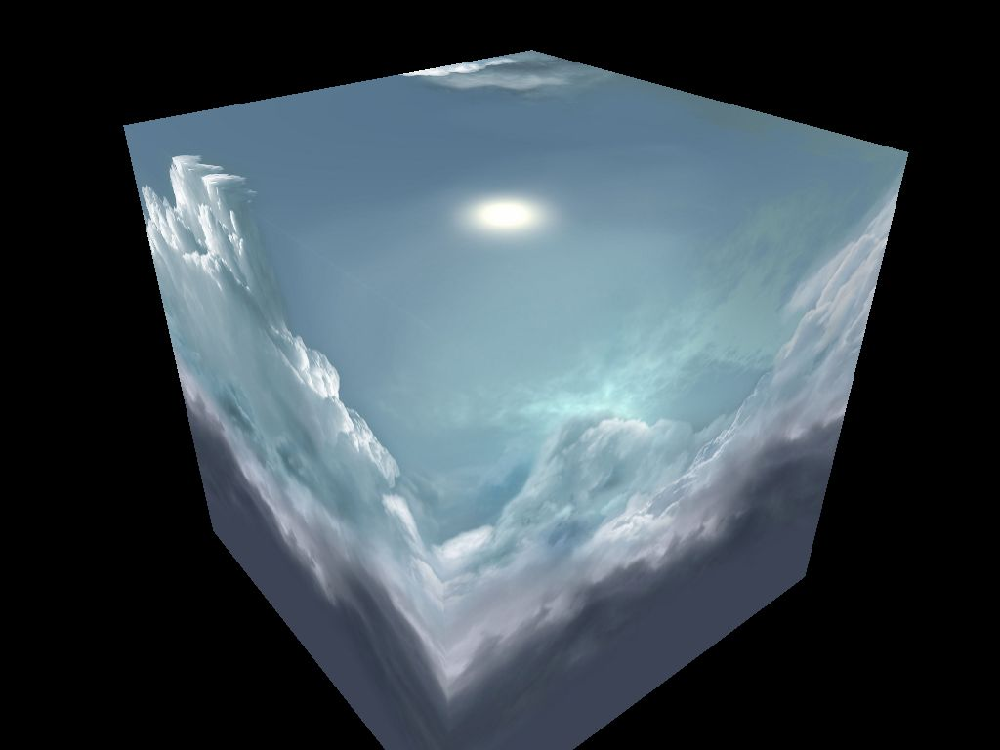
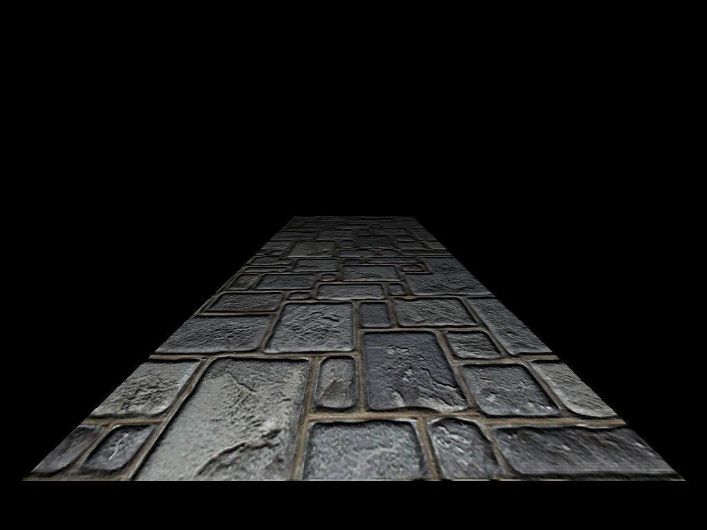

# OpenGL ES 2.0 Simulator # 

Intorduction 
============
This project's main purpose is for simulating a GPU hardware on OpenGL ES 2.0.
It's also my personal OpenGL ES play ground and learning school :).

The project  includes a full OpenGL environment letting *Custom Hardware* 
simulator can run on it. Cause it's a hardware simultor, the OpenGL API
environment's performance is not what I really care about but hardware does.
You can see the whole driver part is making no sense and should be rewritten 
with better method if I have time. But for now, I should focus on the hardware
itself rather than other part which is working fine.

* * *

The detail document can be found [here](http://140.116.164.239/~git/ogles1_1/)

Cause this project is still under development, any unexpected situation is 
possible. Please email or report to me if you find any compiler error or bug.

	
Liou Jhe-Yu (¼B­õ¦t) 
lioujheyu@gmail.com  
National Cheng-kung University, EE Department,  
[Computer Architecture and System Laboratory](http://caslab.ee.ncku.edu.tw/index.html)  
Tainan, Taiwan  
2013/9/25
